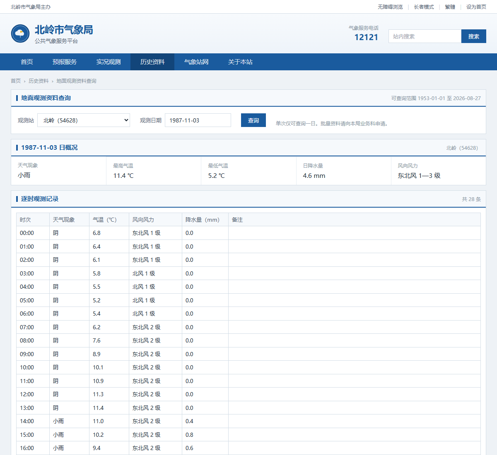
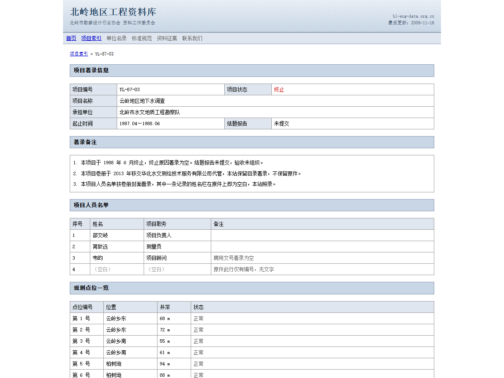
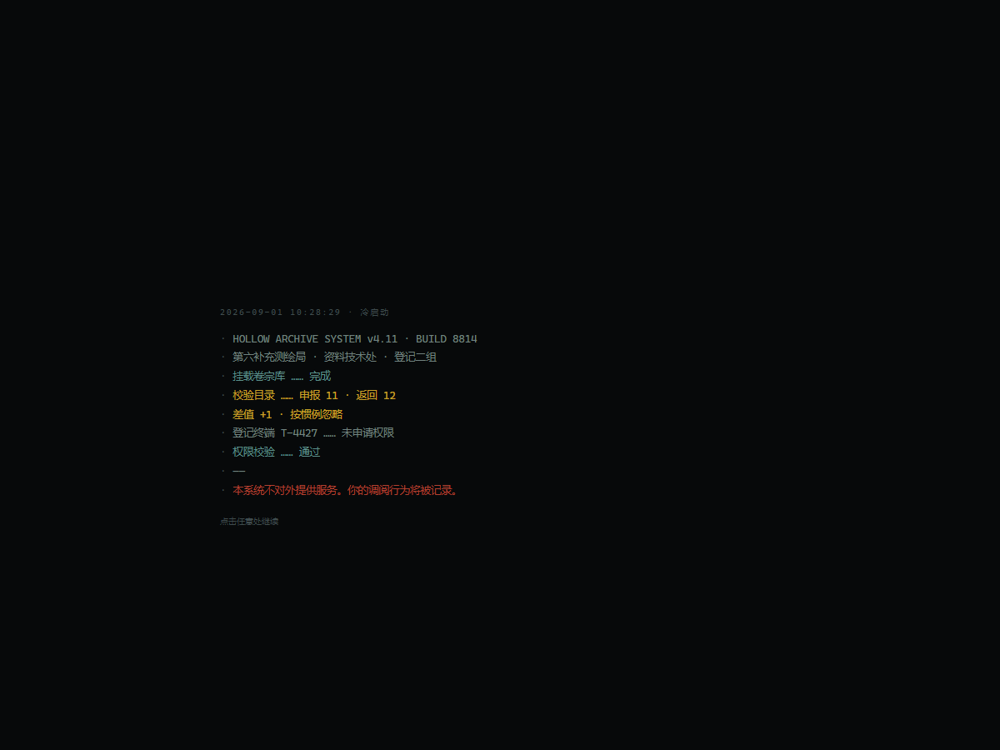

# 空册 · Hollow Archive

一款原创的互联网考古类 ARG 网页游戏。

玩家不扮演任何角色。他从一个招聘网站上的普通职位开始，顺着人名、编号和日期，
在六个互不相干的网站之间来回比对，最后走进一个本不该被他看到的内部系统。

**[▶ 在线试玩](https://ydd91958.github.io/hollow-archive/)**

> 建议先玩再看 [STORY.md](STORY.md)，那份文档含全部剧透。

---

## 六个网站，六套视觉

一个 SPA 里跑着六个「网站」。它们共享数据层和状态机，但视觉系统完全独立——
不复用同一套 Card / Button / Navbar，字体、圆角、间距、配色逐层重做。

玩家在网站之间移动时应该感觉到自己换了一个站，而不是换了一个页面。

| | |
| --- | --- |
|  |  |
| **第一层 · 职引**　商业招聘门户。信息密度、运营位、插画 banner、企业字标系统，做到玩家不会怀疑它是布景 | **第二层 · 北岭市气象局**　政务站。方角、细边框、表格。1987-11-03 那天的自记纸缺了一段 |
|  |  |
| **第二层 · 工程资料库**　2009 年停更的事业单位站。宋体、表格布局、访问计数器 | **第三层 · 空册**　内部登记系统。CRT、扫描线、遮挡条。视觉断层就是叙事本身 |

另外两个站是地方论坛和一位退休测量员的个人博客。

---

## 几个值得看的实现

### 跨站状态机：没有一个网站独自说得清

六个站**彼此不知道对方存在**，只往同一张痕迹表里写「我被看过了」。
`signals.ts` 再从这张表推导出「哪个网站该发生什么变化」。

通往第三层的那扇门有四个条件，一个站一条：

```
第十七号井的著录补充  +  博客《关于一段录音》
      +  论坛被删回复  +  气象站 1987-11-03
                ↓
   工程资料库那条「链接失效」的附件变成可点
```

这不是收集要素。**那 41 分钟的时长，任何单个网站都给不出**：论坛说「四十来分钟」，
记录本写四十，博主坚持四十一。只有气象站的两个时间戳（17:41 中断、18:22 恢复）
能让玩家自己算出来——而页面从头到尾没写过「41」这个数字。

### 回响：挂载时冻结的状态读取

玩家推进到某一阶段后，重访看过的页面会发现个别字句变了。气象站那条最典型：

> 自记纸中断　→　人工观测记录缺失

变化方向永远是「向档案的版本靠拢」，页面从不承认自己变过。

实现上有一个不那么显然的坑：**访问某个页面这件事本身可能就是触发条件的最后一环**。
气象站那一页，打开它就写入痕迹，信号当场成立。如果实时读状态，文字会在玩家眼皮底下
翻一下，而且他永远见不到原版——整个机制就白做了。

所以 `useEchoStage()` 只在组件挂载时算一次，之后这个页面的档位就冻住。
第一次看是原文，离开再回来才变。

### 零依赖的浏览器测试工具链

没装 puppeteer。四个脚本直接用系统里的 Chrome + DevTools Protocol，
Node 自带的全局 `WebSocket` 就够了：

```bash
node scripts/verify-gate.mjs     # 四段回归，13 项断言
node scripts/audit-routes.mjs    # 50 条路由真渲染 + 17 跳可达性
node scripts/check-terms.mjs     # 术语泄漏静态检查
node scripts/check-photos.mjs    # 图片回退，不出裂图
```

`audit-routes` 是被一个真实教训逼出来的：**SPA 的 index.html 对任何路径都返回 200**，
所以用 HTTP 状态码判断可达性是个恒真条件，什么都测不出来。这个脚本真的把每条路由
渲染出来看内容，并逐跳检查「站在 A 页面上，通往 B 的链接到底在不在」。

`check-terms` 守着一条内容约束：第一、二层的玩家可见文案里不得出现第三层的专有名词。
它只扫玩家可见的字符串，代码注释不算。

### 数据与 UI 完全分离

加一份档案 / 一个职位 / 一个帖子 / 一篇博文 = 往对应 `data/` 目录加一个对象，
不改任何组件。

正文用可辨识联合类型描述，`switch` 穷尽检查，加新区块类型时编译器会把所有漏掉的
地方指出来：

```ts
type Block =
  | { kind: 'text'; text: string }
  | { kind: 'margin'; text: string; hand?: string }   // 页边铅笔批注
  | { kind: 'unstable'; variants: string[] }          // 每次读都换措辞
  | { kind: 'registration' }                          // 结局那份待提交的表
  | ...
```

正文里还有几套行内标记，让数据层只描述意图、不关心渲染：

```
{{redact:CLUE_001|1987-11-03}}   遮挡条，持有线索后显影
{{echo:四十来分钟|四十分钟}}       回响
[[华北水测|/company/HBSC]]        跨层链接
```

### 插图全部是代码

没有外部图片依赖。banner 插画、老照片、气象站示意图都是内联 SVG，
再叠一层 CSS 做旧（颗粒、褪色、暗角、冲印白边、日期戳）。

`public/photos/` 下放真实照片可以逐张替换 SVG，加载失败自动退回，
所以永远不会出现裂图。清单和生成提示词在
[`manifest.ts`](src/shared/components/photo/manifest.ts)。

---

## 技术栈

| | |
| --- | --- |
| 构建 | Vite 5 |
| 框架 | React 18 + TypeScript（strict） |
| 路由 | React Router 6，每个站是一个带 Shell 的嵌套路由 |
| 状态 | Zustand + persist，两套互不干涉：跨站痕迹 / 第三层进度 |
| 样式 | Tailwind CSS 3，各层设计令牌分区管理 |
| 部署 | GitHub Actions → GitHub Pages |

运行时依赖只有 React、React Router、Zustand。构建产物 494 kB（gzip 179 kB）。

---

## 规模

六个站 · 50 条路由 · 56 个职位 · 22 家企业 · 13 份档案 · 14 个论坛帖 ·
12 篇博文 · 10 个气象站点

其中约九成内容与主线无关。这是故意的——**一个只有线索的网站，一眼就能看出是布景**。
通关必经节点只有 9 个，56 个职位一个都不用点。

---

## 本地运行

```bash
npm install
npm run dev
```

打开 http://localhost:5173 。

```bash
npm run build       # 类型检查 + 构建
npm run typecheck
```

---

## 文档

- [STORY.md](STORY.md) —— 完整设定、人物、时间线、恐怖手法清单、实现决策。**含全部剧透**
- 下面是开发笔记，玩之前不建议看

<details>
<summary>开发笔记</summary>

### 三层 · 六站

```
/                     第一层 · 职引（招聘平台）        普通中文互联网产品
  └ /jobs/PM-ARCHIVE    项目资料管理员 · 华北水测
  └ /company/HBSC       公司主页 → 代表项目里冒出一个 1987 年的项目
  └ /people/WEIYUN      韦昀 · 资料不完整 → 页面自己列出「资料来源」

/forum                第二层 · 北岭生活论坛
/weather              第二层 · 北岭气象公共服务平台
/proj                 第二层 · 北岭地区工程资料库
/blog                 第二层 · 窗台上的胶卷

/proj/YL-87-03/attach/YL-87-03-A17
                      入口：一条失效的附件链接 → 500 错误 → 移交会话
/sys                  第三层 · 空册
```

层的切换由 `<html data-layer>` 驱动（`useLayerTheme`），`index.css` 按 layer
换 body 底色与字体。

### 第一层的三条发现路径

玩家不该靠遍历五十条职位找线索，而该像正常人一样读资讯、点进去、顺手看一眼职位。

```
A  首页秋招 Banner → 专题 → 正文里的企业名（可点）
B  搜索「资料管理」→ 项目资料管理员
C  名企推荐 → 华北水测
                ↓
      企业主页「公司介绍」默认视图
      企业发展 2006 起 …… 正下方「代表项目」出现 1987.04—1988.06
                ↓
      项目页（资料正在迁移 · 资料来源）→ 第二层
```

**几处关键校准**：

- 1987 与 2006 的矛盾在第一层不作解释。解释留到项目页自己的
  「原承担单位 / 承继保管」字段——在发现的那一刻给，不提前给
- 代表项目模块必须放在「公司介绍」默认视图里，不能只留在第三个 tab：
  玩家没有任何理由去点「项目沿革」，那曾是整条链路唯一的死结
- 核心岗不靠城市过滤藏。首页按发布新鲜度排序，华北水测的水文岗、测绘岗
  （3 天前）正常曝光，而「已连续发布 419 天」的那条自动沉底
- 相似职位按职位族匹配，六条资料岗互相导流，且它们自己也挂着 137 天 / 88 天，
  419 天在这个簇里就是常态

### 跨站信号

```ts
note('person:WEIYUN')      // 韦昀资料页
note('project:YL-87-03')   // 工程资料库的项目页
note('well:17')            // 点开第十七号井的著录补充
note('post:1103')          // 博客「十一月三号」
note('reveal:BBS-DELETED')
note('wx:1987-11-03')      // 气象站历史资料查询
```

| 信号 | 条件 | 页面变化 |
| --- | --- | --- |
| `SIG_RECOMMEND` | 韦昀 + 云岭项目 | 职引「你可能感兴趣」多出一条玩家从未搜过的职位 |
| `SIG_SNAPSHOT` | 论坛核心帖 + 博客「十一月三号」 | 论坛出现「查看本帖历史版本」 |
| `SIG_ATTACHMENT` | 上面那四条，一个站一条 | 资料库的附件由「链接失效」变成可点 |

网站从不承认这些变化和玩家有关。

### 两个环境坑

改完 `tailwind.config.js` 一定要重启 dev server，Vite 不热更新它。
症状是页面 HTTP 200 但整片空白，看 dev server 日志会有 PostCSS 报错。

开发机上如果开着系统代理，localhost 也可能被劫走，所以四个脚本都带
`--no-proxy-server`。不加的话无头浏览器拿不到页面，截出一张白图。

</details>

---

设定、机构、编号体系、人物、地点、事件、术语全部原创，不使用任何既有作品的专有名词。
